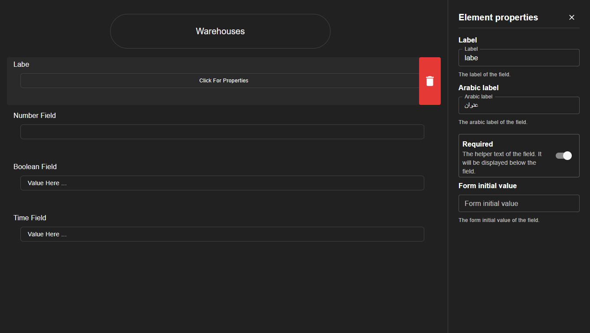
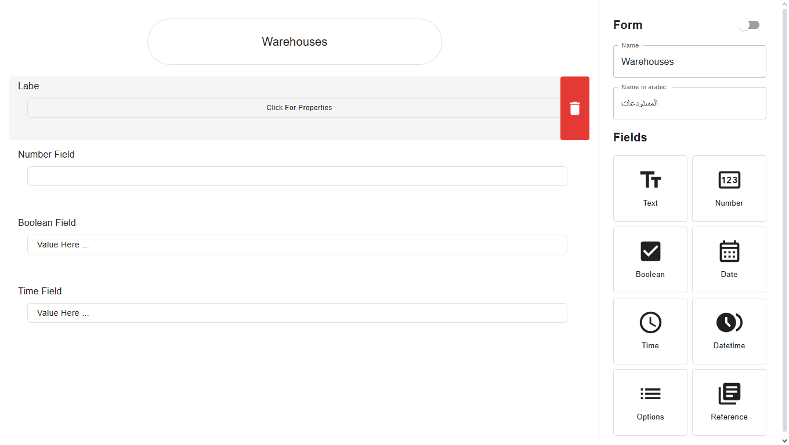

# Quality Management Frontend

A modern web frontend for managing and tracking quality management processes.  
This project is built with **Vite**, **React**, and **TypeScript** to provide a fast, scalable, and developer-friendly experience.

---

## 🚀 Features

-   📊 Template for quality management insights
-   📝 Forms and workflows for process tracking
-   ⚡ Fast and optimized build with Vite
-   🎨 Prettier + ESLint for consistent code style
-   🔒 Git hooks via Husky for code quality checks

---

## 🛠️ Tech Stack

-   [React](https://react.dev/) + [TypeScript](https://www.typescriptlang.org/)
-   [Vite](https://vitejs.dev/)
-   [ESLint](https://eslint.org/) & [Prettier](https://prettier.io/)
-   [Husky](https://typicode.github.io/husky) for git hooks

---

## 🚀 Getting Started

1. **Clone the repository**:

    [](https://github.com/rimarayya/Quality-Management-Frontend)
    [](https://gitlab.com/erp-best-system/quality-management-frontend)

2. **Move to the project file** :

    ```bash
    cd quality-management-frontend
    ```

3. **Install dependencies**:

    ```bash
    npm install
    # or
    yarn install
    ```

4. **Start the development server**:

    ```bash
    npm run dev
    # or
    yarn dev
    ```

5. **Build for production**:

    ```bash
    npm run build
    ```

---

## 📸 Screenshots





---

## 📄 License

This project is licensed under the **MIT License**.

---
